# ud4d

USB Device Detector for Docker usage. Support Linux only because of [cgroups](https://en.wikipedia.org/wiki/Cgroups).

[中文文档](README_CN.md)

## Why



- Build for sharing devices among docker containers.
- Split `/dev/bus/usb` into pieces, for better control, in different container.
- By http-request (recommend) or <del>`link`/`volumes-from`(i do not really know if it works)</del>, other (upper) container can operate android devices via these containers.

## Usage

### Installation

#### Docker

All you need: 1 image.

```shell
sudo docker pull williamfzc/ud4d:0.1.3
```

and, run your ud4d :)

```shell
sudo docker run -d --privileged -v /dev/bus/usb:/dev/bus/usb -v /usr/bin/docker:/bin/docker -v /var/run/docker.sock:/var/run/docker.sock -v /run/udev:/run/udev:ro --net=host --name ud4d_detector williamfzc/ud4d:0.1.3
```

#### Normal way

Based on python3. Install with pip

```shell
pip install ud4d
```

and run it

```shell
from ud4d.api import start_as_server
start_as_server()
```

### Access

now, you can access your devices by http request:

```shell
curl http://127.0.0.1:9410/api/device?serial_no=123456F

# if existed, return something like
/dev/bus/usb/001/009

# else
null
```

## How it works

Based on subsystems of cgroups, we can easily use `udevadm` to detect usb actions.

```shell
➜  udevadm monitor -u --subsystem-match=usb --environment
monitor will print the received events for:
UDEV - the event which udev sends out after rule processing

UDEV  [14578.455127] unbind   /devices/pci0000:00/0000:00:11.0/0000:02:03.0/usb1/1-1/1-1:1.0 (usb)
ACTION=unbind
DEVPATH=/devices/pci0000:00/0000:00:11.0/0000:02:03.0/usb1/1-1/1-1:1.0
DEVTYPE=usb_interface
INTERFACE=255/255/0
PRODUCT=22d9/2774/409
SEQNUM=11716
SUBSYSTEM=usb
TYPE=0/0/0
USEC_INITIALIZED=2145543432

UDEV  [14578.496302] remove   /devices/pci0000:00/0000:00:11.0/0000:02:03.0/usb1/1-1/1-1:1.2 (usb)
ACTION=remove
DEVPATH=/devices/pci0000:00/0000:00:11.0/0000:02:03.0/usb1/1-1/1-1:1.2
DEVTYPE=usb_interface
INTERFACE=255/66/1
MODALIAS=usb:v22D9p2774d0409dc00dsc00dp00icFFisc42ip01in02
PRODUCT=22d9/2774/409
SEQNUM=11730
SUBSYSTEM=usb
TYPE=0/0/0
USEC_INITIALIZED=14578479756
```

Analyse it, and turn it into some PyObject for better usage.

## License

[MIT](LICENSE)
